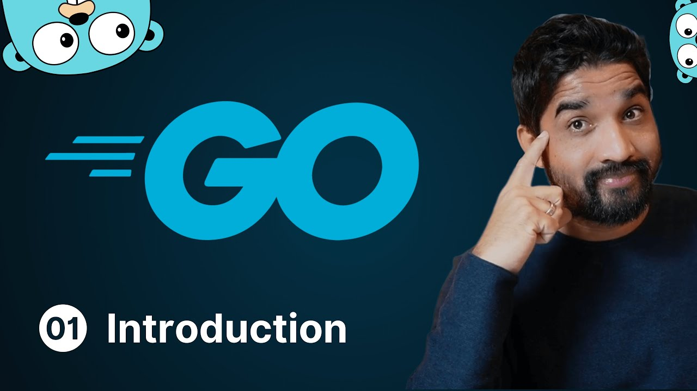

# Coder's Gyan Golang Series



### Link to Playlist: [All the Best](https://www.youtube.com/playlist?list=PLXQpH_kZIxTWUe-Ee-DZEX5gfeoo4tHV6)

## Notes

<details>
<summary>
Chapter 0 - Installing
</summary>

Installing Golang

```bash
sudo apt update
sudo apt install golang -y
```

</details>

<details>
<summary>
Chapter 1 - Hello World
</summary>

Hello World Application

Code Block:

```bash
package main

import "fmt"

func main(){
	fmt.Println("Hello World")
}
```

How to run the code:

`First get to the respective folder having go file, then run the below command`

```bash
go run main.go
```

</details>

<details>
<summary>
Chapter 2 - Simple Values
</summary>
In this chapter we look up on simple values

Code Block:

```bash
package main

import (
	"fmt"
)

func main(){
	// Chapter 3

	// Simple Values

	// Integer
	fmt.Println(1+1)

	// Strings
	fmt.Println("Hello Golang")

	// Booleans
	fmt.Println(true)
	fmt.Println(false)

	//Floats
	fmt.Println(10.58)

	// Division
	fmt.Println(14.0/7.0)
}
```

How to run the code:

`First get to the respective folder having go file, then run the below command`

```bash
go run main.go
```

</details>

<details>
<summary>
Chapter 3 - Type of variables
</summary>

In this chapter we focus on different varibales (int, bool, string), shorthand syntax & types of variables like int32, int 64 etc.

Code Block:

```bash
package main

import (
	"fmt"
)

func main(){
	// var name string = "Aditya"

	// Golang Infers the name type
	// var name = "Aditya"
	// fmt.Println("Hello",name)

	var is_adult = true;
	fmt.Println( is_adult)

	var age int = 23
	fmt.Println(age)

	// Shorthand Syntax
	name := "Aditya"
	fmt.Println(name)

	// Different Scenes
	var age2 int
	age2 = 244
	fmt.Println(age2)

	// Float Example
	var price float32
	price = 22.45
	fmt.Println(price)

	var price2 = 22.56
	fmt.Println(price2)

	price3 := 40.67
	fmt.Println(price3)
}
```

How to run the code:

`First get to the respective folder having go file, then run the below command`

```bash
go run variables.go
```

</details>

<details>
<summary>
Chapter 4 - Constants in golang
</summary>
In this chapter we look upon constants & it's way of writing.

Code Block:

```bash
package main

import "fmt"

const age = 23
const name = "aditya"


func main(){
	const name = "Aditya"
	// name = "Adi"  (Will give an err as constants cannot be changed)
	fmt.Println(name)
	fmt.Println(age)

	const (
		short_name = "adi"
		age = 21
	)
	fmt.Println(short_name)
}
```

How to run the code:

`First get to the respective folder having go file, then run the below command`

```bash
go run constants.go
```

</details>

<details>
<summary>
Chapter 5 - For Loops
</summary>
In this chapter we look upon For Loops & Range in Golang.

Code Block:

```bash
package main

// import "fmt"

// for is the only construct in Golang
func main(){
    // making a while loop
    // i:= 1
    // for i <= 3{
    //     fmt.Println(i)
    //     i++  // Don't forget this
    // }

    // Running an infite loop
    // for{
    //     // You can make a print statement without fmt as below.
    //     println("Aditya")
    //     println(1)
    // }

    // For loops
    // for i:= 0; i <= 3; i++ {
    //     if i == 2{
    //         continue
    //     }
    //     println(i)
    // }

    for i:= range 10{
        println("This number is", i)
    }
}
```

</details>

<details>
<summary>
Chapter 6 - If Else
</summary>

In this chapter we look up on If Else, Else if, Condition Operators & Scopes for varibales.

Code Block:

```bash
package main

import "fmt"

func main() {
	age := 19
	if age >= 18 {
		fmt.Println("Person is an adult.")
	} else{
		fmt.Println(("Person is not an adult"))
	}

	marks := 98
	if marks >= 90 {
		fmt.Println("A+ Grade")
	} else if marks >= 75 && marks < 90 {
		fmt.Println("First Class")
	} else if marks >= 65 &&  marks <= 74 {
		fmt.Println("B Grade")
	} else if marks >= 36 && marks < 74 {
		fmt.Println("C Grade")
	} else{
		fmt.Println("Fail!")
	}

	var role = "Admin"
	var perMissions = false

	// || Or Condition , && AND Condition
	if role == "Admin" && perMissions {
		fmt.Println("User is an admin")
	}else{
		println("User is not an admin")
	}


	// Scoped Vars (Top wala)
	if age:= 20; age >= 18 {
		println("Person is an adult")
		println(age)
	}else{
		println("NAH")
	}

	// Gloabl age
	println(age)

	// Go doesn't have ternary operator
}

```

</details>

<details>
<summary>
Chapter 7 - Switch Statements
</summary>

In this chapter, we look up on Normal, Mutliple Condition & Type Switch Statements.

Code Block:

```bash
package main

import (
	"time"
)


func main(){
	i := 3

	// Normal Switch
	switch i {
	case 1:
		println("Value of i is 1")
	case 2:
		println("Value of i is 2")
	case 3:
		println("Value of i is 3")
	default:
		println("Value of i is more than 3 or less than 1")
	}

	// Multiple Condition Switch
	switch time.Now().Weekday(){
	case time.Saturday, time.Sunday:
		println("It is Weekend!")
	default:
		println("Kaam kar le bhai")
	}

	// Type Switch
	whoAmI := func (i interface{})  {
		switch i.(type){
		case int:
			println("It is an interger")
		case string:
			println("it is a string")
		case bool:
			println("It is a Boolean")
		default:
			println("It is a type of others")
	}
}
whoAmI("Aditya")
}
```

</details>

<details>
<summary>
Chapter 8 - Arrays
</summary>

In this chapter, we look upon Arrays in Golang

Code Block:

```bash
package main

import "fmt"


func main(){

	// Zero Values Init mai
	// String => "", Int => 0, Boolean => false

	var nums [4]int

	// println(len(nums))
	nums[1] = 25;
	nums[2] = 255;

	// println(nums[1])
	// println(nums[2])

	// fmt.Println(len(nums))
	// println(nums) // Gives error
	// fmt.Println(nums) // Works because of fmt lib

	// False Values Init mai
	var vals[4]bool
	// fmt.Println(vals)
	vals[2] = true;
	// fmt.Println(vals)


	// Strings
	var names[3]string
	// fmt.Println(names)
	names[0] = "golang"
	// 1st position is being skipped and not showed like Int or Bool.
	names[2] = "Aditya"
	// fmt.Println(names)
	// Space is reserved but not being used and shadow is being returned.
	// fmt.Println(len(names))

	// Adding elements while declaration
	// number:=[3]int{1,2,3}
	// fmt.Println(number)

	// var name -> size of the arr -> type of arr > {values} -> cool hai
	// num2 :=[4]int{4,56,6}
	// fmt.Println(num2)

	// // 2D Arrays
	numbers := [2][2]int{{1,2},{3,4}}
	fmt.Println(numbers)

	// 3D Arrays -> 3 times [2] means it is a 3D array and each array can have only 2 values 0th and 1st position. Play with it, then u can get it better.
	num2 := [2][2][2]int{{{1,2},{1,3}},{{1,4},{2,4}}}
	fmt.Println(num2)

	// Usage:
	// - fixed size arrays only
	// - memory optimization
	// - constant time access
}

```

</details>

## Happy Coding :)
