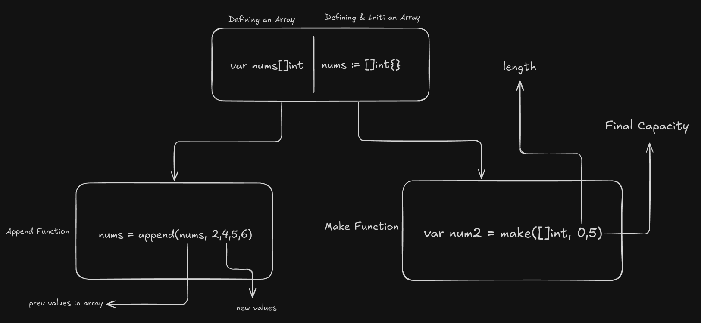

# Coder's Gyan Golang Series


### Link to Playlist: [All the Best](https://www.youtube.com/playlist?list=PLXQpH_kZIxTWUe-Ee-DZEX5gfeoo4tHV6)

## Notes

<details>
<summary>
Chapter 0 - Installing
</summary>

Installing Golang

```bash
sudo apt update
sudo apt install golang -y
```

</details>

<details>
<summary>
Chapter 1 - Hello World
</summary>

Hello World Application

Code Block:

```bash
package main

import "fmt"

func main(){
	fmt.Println("Hello World")
}
```

How to run the code:

`First get to the respective folder having go file, then run the below command`

```bash
go run main.go
```

</details>

<details>
<summary>
Chapter 2 - Simple Values
</summary>
In this chapter we look up on simple values

Code Block:

```bash
package main

import (
	"fmt"
)

func main(){
	// Chapter 3

	// Simple Values

	// Integer
	fmt.Println(1+1)

	// Strings
	fmt.Println("Hello Golang")

	// Booleans
	fmt.Println(true)
	fmt.Println(false)

	//Floats
	fmt.Println(10.58)

	// Division
	fmt.Println(14.0/7.0)
}
```

How to run the code:

`First get to the respective folder having go file, then run the below command`

```bash
go run main.go
```

</details>

<details>
<summary>
Chapter 3 - Type of variables
</summary>

In this chapter we focus on different varibales (int, bool, string), shorthand syntax & types of variables like int32, int 64 etc.

Code Block:

```bash
package main

import (
	"fmt"
)

func main(){
	// var name string = "Aditya"

	// Golang Infers the name type
	// var name = "Aditya"
	// fmt.Println("Hello",name)

	var is_adult = true;
	fmt.Println( is_adult)

	var age int = 23
	fmt.Println(age)

	// Shorthand Syntax
	name := "Aditya"
	fmt.Println(name)

	// Different Scenes
	var age2 int
	age2 = 244
	fmt.Println(age2)

	// Float Example
	var price float32
	price = 22.45
	fmt.Println(price)

	var price2 = 22.56
	fmt.Println(price2)

	price3 := 40.67
	fmt.Println(price3)
}
```

How to run the code:

`First get to the respective folder having go file, then run the below command`

```bash
go run variables.go
```

</details>

<details>
<summary>
Chapter 4 - Constants in golang
</summary>
In this chapter we look upon constants & it's way of writing.

Code Block:

```bash
package main

import "fmt"

const age = 23
const name = "aditya"


func main(){
	const name = "Aditya"
	// name = "Adi"  (Will give an err as constants cannot be changed)
	fmt.Println(name)
	fmt.Println(age)

	const (
		short_name = "adi"
		age = 21
	)
	fmt.Println(short_name)
}
```

How to run the code:

`First get to the respective folder having go file, then run the below command`

```bash
go run constants.go
```

</details>

<details>
<summary>
Chapter 5 - For Loops
</summary>
In this chapter we look upon For Loops & Range in Golang.

Code Block:

```bash
package main

// import "fmt"

// for is the only construct in Golang
func main(){
    // making a while loop
    // i:= 1
    // for i <= 3{
    //     fmt.Println(i)
    //     i++  // Don't forget this
    // }

    // Running an infite loop
    // for{
    //     // You can make a print statement without fmt as below.
    //     println("Aditya")
    //     println(1)
    // }

    // For loops
    // for i:= 0; i <= 3; i++ {
    //     if i == 2{
    //         continue
    //     }
    //     println(i)
    // }

    for i:= range 10{
        println("This number is", i)
    }
}
```

</details>

<details>
<summary>
Chapter 6 - If Else
</summary>

In this chapter we look up on If Else, Else if, Condition Operators & Scopes for varibales.

Code Block:

```bash
package main

import "fmt"

func main() {
	age := 19
	if age >= 18 {
		fmt.Println("Person is an adult.")
	} else{
		fmt.Println(("Person is not an adult"))
	}

	marks := 98
	if marks >= 90 {
		fmt.Println("A+ Grade")
	} else if marks >= 75 && marks < 90 {
		fmt.Println("First Class")
	} else if marks >= 65 &&  marks <= 74 {
		fmt.Println("B Grade")
	} else if marks >= 36 && marks < 74 {
		fmt.Println("C Grade")
	} else{
		fmt.Println("Fail!")
	}

	var role = "Admin"
	var perMissions = false

	// || Or Condition , && AND Condition
	if role == "Admin" && perMissions {
		fmt.Println("User is an admin")
	}else{
		println("User is not an admin")
	}


	// Scoped Vars (Top wala)
	if age:= 20; age >= 18 {
		println("Person is an adult")
		println(age)
	}else{
		println("NAH")
	}

	// Gloabl age
	println(age)

	// Go doesn't have ternary operator
}

```

</details>

<details>
<summary>
Chapter 7 - Switch Statements
</summary>

In this chapter, we look up on Normal, Mutliple Condition & Type Switch Statements.

Code Block:

```bash
package main

import (
	"time"
)


func main(){
	i := 3

	// Normal Switch
	switch i {
	case 1:
		println("Value of i is 1")
	case 2:
		println("Value of i is 2")
	case 3:
		println("Value of i is 3")
	default:
		println("Value of i is more than 3 or less than 1")
	}

	// Multiple Condition Switch
	switch time.Now().Weekday(){
	case time.Saturday, time.Sunday:
		println("It is Weekend!")
	default:
		println("Kaam kar le bhai")
	}

	// Type Switch
	whoAmI := func (i interface{})  {
		switch i.(type){
		case int:
			println("It is an interger")
		case string:
			println("it is a string")
		case bool:
			println("It is a Boolean")
		default:
			println("It is a type of others")
	}
}
whoAmI("Aditya")
}
```

</details>

<details>
<summary>
Chapter 8 - Arrays
</summary>

In this chapter, we look upon Arrays in Golang

Code Block:

```bash
package main

import "fmt"


func main(){

	// Zero Values Init mai
	// String => "", Int => 0, Boolean => false

	var nums [4]int

	// println(len(nums))
	nums[1] = 25;
	nums[2] = 255;

	// println(nums[1])
	// println(nums[2])

	// fmt.Println(len(nums))
	// println(nums) // Gives error
	// fmt.Println(nums) // Works because of fmt lib

	// False Values Init mai
	var vals[4]bool
	// fmt.Println(vals)
	vals[2] = true;
	// fmt.Println(vals)


	// Strings
	var names[3]string
	// fmt.Println(names)
	names[0] = "golang"
	// 1st position is being skipped and not showed like Int or Bool.
	names[2] = "Aditya"
	// fmt.Println(names)
	// Space is reserved but not being used and shadow is being returned.
	// fmt.Println(len(names))

	// Adding elements while declaration
	// number:=[3]int{1,2,3}
	// fmt.Println(number)

	// var name -> size of the arr -> type of arr > {values} -> cool hai
	// num2 :=[4]int{4,56,6}
	// fmt.Println(num2)

	// // 2D Arrays
	numbers := [2][2]int{{1,2},{3,4}}
	fmt.Println(numbers)

	// 3D Arrays -> 3 times [2] means it is a 3D array and each array can have only 2 values 0th and 1st position. Play with it, then u can get it better.
	num2 := [2][2][2]int{{{1,2},{1,3}},{{1,4},{2,4}}}
	fmt.Println(num2)

	// Usage:
	// - fixed size arrays only
	// - memory optimization
	// - constant time access
}

```

</details>

<details>
<summary>
Chapter 9 - Slices
</summary>

In this chapter, we look upon Slices in Golang

Code Block:

```bash
package main

import (
	// "fmt"
	// "slices"
)

// Slices => Dynamic Arrays
// useful methods
func main(){

	// uninit slices are nil === null
	// Array is defined, no init of input values -> {}.

	var nums[]int  // -> Start Point
	// fmt.Println(nums)
	// fmt.Println(nums == nil)
	// fmt.Println(len(nums))
	// fmt.Println(cap(nums))
	nums = append(nums, 1,3)
	// fmt.Println(nums)


	// Make Method
	// Not a nil size
	// Making a array bit

	// var nums = make([]int, 0)

	// var nums2 = make([]int, 3,5)
	// Capacity is 5 and 3 signifies 3 times zero(0) in the array -> [0 0 0]
	// fmt.Println(cap(nums2)) // -> Answer is 5 (Capacity)

	// var nums3 = make([]int, 0,5)
	// nums3 = append(nums3, 2,5)
	// fmt.Println(nums3)

	// Cap means capacity -> maximum number of elements can fit.

	// Adding elements from the end
	// nums = append(nums, 2,1,2,3,4,5,6,7)

	// fmt.Println(nums)
	// fmt.Println(len(nums)) // Cap is 8 -> total elements present in the array
	// fmt.Println(cap(nums))
	// fmt.Println(nums)

	// Array [] and input {} is defined.
	numbers := []int{}
	// when u define a slice, it is not nil. It takes some memory in the system, so it will not be nil.

	// fmt.Println(numbers == nil)
	// fmt.Println(numbers)
	// fmt.Println(cap(numbers)) // -> 0
	// fmt.Println(len(numbers)) // -> 0

	numbers = append(numbers, 1,2,3,4)
	// fmt.Println(len(numbers))

	numbers = append(numbers, 1,2,3,4)
	// fmt.Println(len(numbers))

	numbers = append(numbers, 1,2,3,4)
	// fmt.Println(numbers)
	// fmt.Println(len(numbers))
	// fmt.Println(cap(numbers))

	// Moral -> Capacity is doubled if needed and if the array fits well, it doesn't change the size of the array. Cool hai.

	// var temp = make([]int,1,5)
	// temp = append(temp, 1,4)
	// fmt.Println(len(temp))
	// fmt.Println(cap(temp))
	// temp[0] = 3
	// fmt.Println(temp)

	// Copy Function
	var copy1 = make([]int, 0,5)
	copy1 = append(copy1, 2)
	var copy2 = make([]int, len(copy1))

	// copy
	copy(copy2, copy1)
	// fmt.Println(copy1, copy2)

	// Slice Operator
	// 0:2 -> means start from 0th Index and go upto to 2nd Index and exclude the last value[2] here.
	// var slice = []int{0,1,2}
	// fmt.Println(slice[0:2])

	// Start from first
	// fmt.Println(slice[:2])

	// Go till last of the array
	// fmt.Println(slice[0:])

	// Comparing of slices
	// var slice1 = []int{1,2}
	// var slice2 = []int{1,2}

	// returns a bool
	// fmt.Println(slices.Equal(slice1,slice2))

	// 2D Arrays in Slices
	// var slice3 = [][]int{{1,2,3},{4,5,6}}
	// fmt.Println(slice3)
}

```



</details>

<details>
<summary>
Chapter 10 - Maps
</summary>

In this chapter, we look upon Maps in Golang

Code Block:

```bash
package main

import (
	"fmt"
	"maps"
)

func main(){

	// Defining an Element
	m := make(map[string]string)
	// fmt.Println(m)

	// Setting an Element
	m["name"] = "Aditya"
	m["surname"] = "Vyas"
	// fmt.Println(m)

	// get an element
	// fmt.Println(m)
	// fmt.Println(m["name"], m["surname"])
	// fmt.Println(len(m))

	//Imp
	// fmt.Println(m["age"])
	// if key doesn't exists in the map, it returns zero value like above example.

	m2 := make(map[string]int)
	m2["age"] = 21
	m2["pincode"] = 777777
	// String ->      , Int -> 0, Bool -> false
	// fmt.Println(m2["age"], m2["phone_number"])

	// Delete Function
	// delete(m2, "age")
	// fmt.Println(m2)

	clear(m2)
	// fmt.Println(m2)

	// One of the ways to create a map
	m3 := map[string]int{"price": 30}
	// fmt.Println(m3)

	// Maps Checking
	err, ok := m3["prie"]
	if ok {
		fmt.Println("Cool hai Ji")
	}else{
		fmt.Println(err)
	}
	// fmt.Println(key)

	// Maps Equality
	m4 := map[string]int{"price": 30}
	m5 := map[string]int{"price": 33}

	fmt.Println(maps.Equal(m4,m5))
}

```

</details>

<details>
<summary>
Chapter 11 - Range
</summary>

In this chapter, we will look upon Range in Golang which helps us in looping on a map or a variable or an array.

Code Block:

```bash
package main

import (
	"fmt"
)

func main()  {
	 // Iterating over data structures.

	 nums := []int{5,6,7,8}

	//  for i:= 0; i <len(nums); i++{
	// 	fmt.Println(nums[i])
	//  }

	for i, num := range nums{
		fmt.Println(i, num)
	}

	// m:= map[string]string{"fname": "john", "lname": "doe"}

	// for k,v := range m{
	// 	fmt.Println(k,v)
	// }

	// Unicode | code point rune
	// 0,1,2 it is not index. It is the start of Rune.
	for i,c := range "golang"{
		fmt.Println(i,string(c))
	}
}
```

</details>

<details>
<summary>
Chapter 12 - Functions
</summary>

In this chapter we have learnt about Functions in Golang.

Code Block:

```bash
package main

import "fmt"

func add(a,b int) int{
	return a+b
}

func getLangauges()(string,string, int){
	return "golang", "JS", 34
}

// func processIt(fn func(a int)int){
// 	fn(1)
// }

func processIt() func(a int) int {
	return func (a int) int {
		return 4
	}
}


func main(){

	total := add(3,2)
	fmt.Println(total)

	// fmt.Println(getLangauges())
	l1, l2 , _ := getLangauges()
	fmt.Println(l1,l2)

	// fn := func (a int ) int {
	// 		return 2
	// }

	fn := processIt()
	fn(7)

}
```

</details>

<details>
<summary>
Chapter 13 - Variadic Functions
</summary>

In this chapter we learn about how Variadic Functions Work.

Code Block:

```bash
package main

import "fmt"

func sum (nums ...int) int {
	total := 0;

	for _,num := range nums {
		total = total + num
	}
	return total
}


func main(){
	nums := []int{3,3,3,3,3}
	result := sum(nums...)
	fmt.Println(result)
}
```

</details>

<details>
<summary>
Chapter 14 - Clousers
</summary>

In this chapter we learn about how Clousers in Golang.

Code Block:

```bash
package main

import "fmt"

func counter() func() int {
    var count int = 0

    return func() int {
        count += 1
        return count
    }
}


func main(){
	increment := counter()
    fmt.Println(increment())
}
```

</details>

<details>
<summary>
Chapter 15 - Pointers
</summary>

In this chapter, we learn about Pointers, Referencing & Deferencing;

Code Block:

```bash
package main

import "fmt"

// num is not passed directly, a copy/vlaue of it is passed in the function runtime.
// func changeNum (num int) {
// 	num = 7
// 	fmt.Println("In Change Num: ", num)
// }

// By Reference

func changeNum(num *int){

	fmt.Println("Before In Change Function Call: ", *num)
	*num = 5
	fmt.Println("In Num Change Value", *num)
}

func main(){

	num := 10
	// changeNum(number)


	fmt.Println("Before Function Call: ", num)
	changeNum(&num)
	fmt.Println("After Function Num: ", num)

	// fmt.Println("Value of Number", number)
	// fmt.Println("Location of number in memory", &number)
}
```

</details>

<details>
<summary>
Chapter 16 - Strcut
</summary>

In this chapter, we have learnt about Struct & we can Init it in different ways and use it in different ways.

Code Block:

```bash
package main

import (
	"fmt"
	"time"
)

type customer struct{
	name string
	phone string
}

type order struct {
	id string
	amount float32
	status string
	createdAt time.Time // It has a nano sec precision
	customer
}

func (o *order) changeStatus (status string){
	o.status = status
}

// receiver type
func (a order) getAmount () float32 {
	return a.amount
}

// Dynamic Instance creation of struct using Functions.
func newOrder  (id string, amount float32, status string) *order {
	myOrder := order{
		id : id,
		amount: amount,
		status: status,
	}
	return &myOrder
}

func main (){

	// newCustomer:= customer{
	// 	name: "Adi",
	// 	phone: "1234",
	// }

	newOrder := order{
		id: "23",
		amount: 45,
		status: "received",
		// customer:newCustomer,
		customer: customer{name: "Adi", phone: "124"},
	}

	fmt.Println(newOrder)
	newOrder.customer.name = "Aditya"
	fmt.Println(newOrder)

	// order := struct {
	// 	id string
	// 	amount float32
	// 	status string
	// }{"1", 100, "Done"}

	// fmt.Println(order)

	// langauge := struct{
	// 	name string
	// 	age float32
	// }{"Adi", 21}

	// fmt.Println(langauge)


	// myOrder :=  newOrder("1",22,"done")
	// // fmt.Println(newOrder("1",22, "Done"))
	// fmt.Println(myOrder.amount)


	// If you don't set any of the fields, then default values are enforced on the print statement for the specific variable/object.

	// Int -> 0
	// String -> Empty space " "

	// 	In Go, nil represents the zero value for several types, including:
	// Pointers: A pointer that doesn't point to anything is nil.
	// Slices: An empty slice is represented by nil.
	// Maps: An empty map is nil.
	// Channels: A channel that hasn't been initialized is nil.
	// Functions: A function that hasn't been assigned a value is nil.
	// Interfaces: An interface variable that doesn't hold any value is nil.

// 	Not all zero values are nil:
	// For example, the zero value of an integer is 0, not nil. Similarly, the zero value of a string is "" (an empty string), not nil.
// Comparing with nil:
	// You can use the == operator to check if a variable of the above types is nil


	// myOrder := order{
	// 	id : "1",
	// 	// amount: 100.00,
	// 	status: "Delivered",
	// }

	// Phase 1 Started
	// Created sepeartely
	// myOrder.createdAt = time.Now()
	// println("")
	// fmt.Println("Total Order Details: ", myOrder)
	// println("")
	// println("Specific Details: ")
	// println("")
	// fmt.Println("Order id: ", myOrder.id)
	// fmt.Println("Order amount: ", myOrder.amount)
	// fmt.Println("Order status: ", myOrder.status)
	// fmt.Println("Order createdAt: ", myOrder.createdAt)
	// println("")
	// Phase 1 Ended


	// Phase 2 Started

	// myOrder2 := order{
	// 	id : "2",
	// 	amount: 23,
	// 	status: "In Progress",
	// 	createdAt: time.Now(),
	// }

	// myOrder.amount = 266;
	// fmt.Println(myOrder)
	// fmt.Println(myOrder2)

	// Phase 2 Ended

	// Phase 3
	// myOrder.changeStatus("Confirmed")
	// fmt.Println(myOrder)
	// fmt.Println(myOrder.status)
	// fmt.Println(myOrder.getAmount())
	// Phase 3 Ended
}
```
</details>

<details>
<summary>
Chapter 17 - Interface
</summary>

In this chapter, we have learnt about Interface in Golang.

Code Block:
```bash
package main

import "fmt"

type paymenter interface{
    pay(amount float32)
}

type payment struct{
    gateway paymenter
}

func (p payment) makePayment (amount float32){
    // razorPaymentGw := razorPay{}
    // razorPaymentGw.pay(amount)
    p.gateway.pay(amount)
}

type razorPay struct{}

func (r razorPay) pay (amount float32){
    // Logic to make payment
    fmt.Println("Making payment using RazorPay", amount)
}

type stripe struct{}

func (s stripe) pay  (amount float32){
    // Logic to make payment
    fmt.Println("Making payment using Stripe", amount)
}

func main()  {
    // stripePaymentGw := stripe{}
    razorPaymentGw := razorPay{}
    newPayment := payment{
        gateway: razorPaymentGw,
    }
    newPayment.makePayment(100)
}
```
</details>

<details>
<summary>
Chapter 18 - Enums
</summary>

In this chapter, we have learnt about Enums in Golang

Code Blocl:
```bash
package main

import "fmt"

// enumrated types
type orderStatus string 
type orderStatusNum int
const (
	Received orderStatus = "recevied"
	Confirmed 			 = "confirmed" 
	Prepared			 = "prepared"
	Delivered		 	 = "delivered"
)

const (
	Received1 orderStatusNum = iota
	Confirmed1 			  
	Prepared1			 
	Delivered1		 	 
)

func changeOrderStatus (status orderStatus) {
	fmt.Println("Changing order status to", status)
}

func changeOrderStatusNum (status orderStatusNum) {
	fmt.Println("Changing order status to", status)
}

func main(){
	changeOrderStatus(Confirmed)
	changeOrderStatusNum(Prepared1)
}
```

</details>
<details>
<summary>
Chapter 19 - Generics
</summary>

In this chapter, we are learning about Generics in Golang

Code Block: 
``` bash
package main

import "fmt"

func printSlice[T comparable, N string](items []T, name N){
	for _, item := range items{
		fmt.Println(item, name)
	}
}

// func printStringSlice(items []string){
// 	for _, item := range items{
// 		fmt.Println(item)
// 	}
// }

// Stack -> LIFO
type Stack[T string | int] struct{
	elements [] T
}


func main(){

	myStack := Stack[int]{
		elements: []int{2,3,45,56,7,8,8,9},
	}

	fmt.Println(myStack)


	// nums := []int{1,24,5,6}
	// nums := []int{1,24,5,6}
	boolval := []bool{true, false, true}
	// names := []string{"golang", "typescript"}
	printSlice(boolval, "John")
	// printStringSlice(names)
}
```
</details>

<details>
<summary>
Chapter 20 - Goroutines
</summary>

In this chapter, we learn about Goroutines

Code Block:

```bash
package main

import (
	"fmt"
	"time"
)

// func task (id int){
// 	fmt.Println("Doing Task",id)
// }

func main(){
	for i := 0; i <= 20; i++{
	
		go func(i int){
			fmt.Println(i)
		}(i)
	}

	time.Sleep(time.Second * 1)
}
```
</details>

<details>
<summary>
Chapter 20 Extension - Waitgroups
</summary>

In this chapter, we have added waitgroups for goroutines

Code Block:
```bash
package main

import (
	"fmt"
	"sync"
)

func task (id int, w *sync.WaitGroup){
	defer w.Done()
	fmt.Println("Doing Task",id)
}

func main(){
	var wg sync.WaitGroup
	for i := 0; i <= 10; i++{
		go func(i int){
			wg.Add(1)
			go task(i, &wg)
		}(i)
		wg.Wait()
	}
}
```
</details>

<details>
<summary>
Chapter 21 - Channels
</summary>

In this chapter, we have learnt a lot of things about channels, combining channels, type safe channels and many more. Visit code for more info.

Code Block:

```bash
package main

import (
	"fmt"
	"time"
)

//sending
// func processNum (numChan chan int){
// 	for num := range numChan{
// 		fmt.Println("Processing", num)
// 		time.Sleep(time.Second * 1)
// 	}
// }

//receive
// func sum (result chan int, num1 int, num2 int){
// 	finalResult := num1 + num2
// 	result <- finalResult
// }

// goroutine synchronizer
// func task (done chan bool){
// 	defer func ()  {
// 		done <- true
// 	}()
// 	fmt.Println("Processing...")
// }

//Email Channel
func emailSender(emailChan <-chan string, done chan<- bool){

	defer func ()  {
		done <- true
	}()

	for email := range emailChan{
		fmt.Println("Sending emails to", email)
		time.Sleep(time.Second)
	}
}

func main(){

	// chan1 := make(chan int)
	// chan2 := make(chan string)

	// go func ()  {
	// 	chan1 <- 10	
	// }()

	// go func() {
	// 	chan2 <- "golang"
	// }()

	// 	for i := 0; i < 2; i++{
	// 		select{
	// 		case chan1Val := <- chan1:
	// 			fmt.Println("received data from chan1", chan1Val)
	// 		case chan2Val := <- chan2:
	// 			fmt.Println("received data from chan2", chan2Val)
	// 		}
	// 	}

	// Email Channel
	// emailChan := make(chan string, 100)

	// done := make(chan bool)

	// go emailSender(emailChan, done)

	// for i := 0; i < 6 ; i ++{
	// 	emailChan <- fmt.Sprintf("%d@gmail.com", i)
	// }

	// fmt.Println("Done Processing")
	// close(emailChan)
	// <- done
	// emailChan <- "1@demo.com"
	// emailChan <- "2@demo.com"


	// done := make(chan bool)
	// go task(done)

	// <- done // blocking


	// result := make(chan int)
	// go sum(result,4,5)

	// res := <- result // blocking

	// fmt.Println(res)

	// numChan := make(chan int)
	// go processNum(numChan)

	// for{
	// 	numChan <- rand.Intn(100)
	// }

	// messageChan := make(chan string)
	// messageChan <- "ping & pong" // Blocking Operation
	// msg := <-messageChan
	// fmt.Println(msg)
}
```
</details>

<details>
<summary>
Chapter 22 - Mutex
</summary>

In this chapter, we learn about how we can handle concurrent request using Mutex

Code Block:
```bash
package main

import (
	"fmt"
	"sync"
)
type post struct{
	views int
	mu sync.Mutex
}


func (p *post) inc(wg *sync.WaitGroup){
	defer func ()  {	
	p.views += 1;
	wg.Done()	
	}()

	p.mu.Lock()
	p.mu.Unlock()
}

func main(){
	var wg sync.WaitGroup
	myPost := post{views: 0}

	for i:= 0; i < 100 ; i++{
		wg.Add(1)
		go myPost.inc(&wg)
	}

	wg.Wait()
	fmt.Println(myPost.views)

}
```
</details>

<details>
<summary>
Chapter 23 - Files
</summary>

In this chapter we are learning about how we can create, update and delete files using Golang.

Code Block:
```bash
package main

import (
	"fmt"
	"os"
)

func main(){
	// f, err := os.Open("example.txt")
	// if err != nil {
	// 	// error handling / logging the error
	// 	panic(err)
	// }

	// fileInfo, err := f.Stat()
	// if err != nil {
	// 	// error handling / logging the error
	// 	panic(err)
	// }

	// fmt.Println("file name: ", fileInfo.Name())
	// fmt.Println("file true or dir false: ",fileInfo.IsDir())
	// fmt.Println("file size: ",fileInfo.Size(), " bytes")
	// fmt.Println("file permissions: ",fileInfo.Mode())
	// fmt.Println("file modified: ",fileInfo.ModTime())
	// f, err := os.Open("example.txt")
	// if err != nil {
	// 	// error handling / logging the error
	// 	panic(err)
	// }

	// fileInfo, err := f.Stat()
	// if err != nil {
	// 	// error handling / logging the error
	// 	panic(err)
	// }

	// fmt.Println("file name: ", fileInfo.Name())
	// fmt.Println("file true or dir false: ",fileInfo.IsDir())
	// fmt.Println("file size: ",fileInfo.Size(), " bytes")
	// fmt.Println("file permissions: ",fileInfo.Mode())
	// fmt.Println("file modified: ",fileInfo.ModTime())

	// read file - 1st Method
	// f, err := os.Open("example.txt")
	// if err != nil{
	// 	panic(err)
	// }

	// defer f.Close()

	// buff := make([]byte, 110)
	// d, err := f.Read(buff)
	// if err != nil{
	// 	panic(err)
	// }

	// for i := 0 ; i < len(buff) ; i++{
	// 	println("data", d,string(buff[i]))
	// }

	// read file - 2nd Method
	// should use only for small size of files
	// data, err := os.ReadFile("example.txt")
	// if err != nil{
	// 	panic(err)
	// }

	// fmt.Println(string(data))


	// reading folders

	// dir, err := os.Open("../")
	// if err != nil{
	// 	panic(err)
	// }

	// defer dir.Close()

	// fileInfo, err := dir.ReadDir(0)

	// for _, fi := range fileInfo{
	// 	fmt.Println(fi.Name(), fi.IsDir())
	// }

	// writing in files
	f, err := os.Create("example2.txt")
	if err != nil{
		panic(err)
	}
	defer f.Close()

	// f.WriteString("hi golang!")

	// bytes := []byte("Hello Go")
	// f.Write(bytes)

	// read and write to another file (streaming fashion)
	// sourceFile, err := os.Open("example.txt")
	// if err != nil{
	// 	panic(err)
	// }

	// defer sourceFile.Close()

	// destFile, err := os.Create("example2.txt")
	// if err != nil{
	// 	panic(err)
	// }

	// defer destFile.Close()

	// reader := bufio.NewReader(sourceFile)
	// writer := bufio.NewWriter(destFile)

	// for {
	// 	b, err := reader.ReadByte()
	// 	if err != nil{
	// 		if err.Error() != "EOF"{
	// 			panic(err)
	// 		}
	// 		break
	// 	}

	// 	e := writer.WriteByte(b)
	// 	if err != nil{
	// 		panic(e)
	// 	}
	// }

	// writer.Flush()

	// fmt.Println("Written to new file successfully!")

	// Deleting a file

	os.Remove("example2.txt")

	fmt.Println("file removed")
}
```
</details>

## Happy Coding :)
